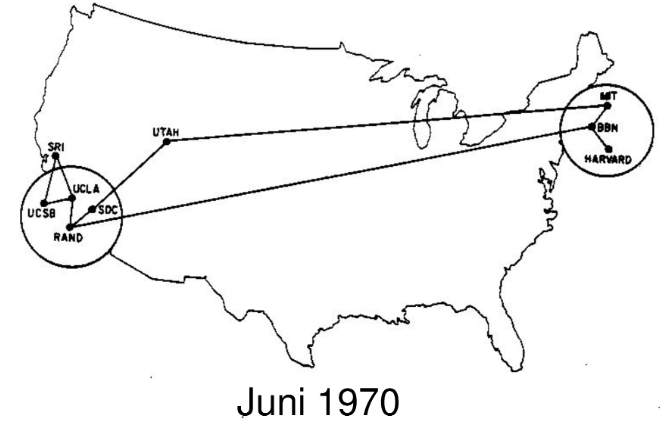
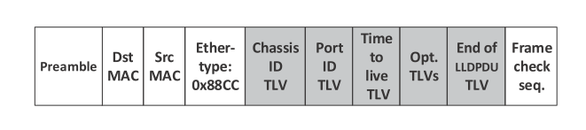
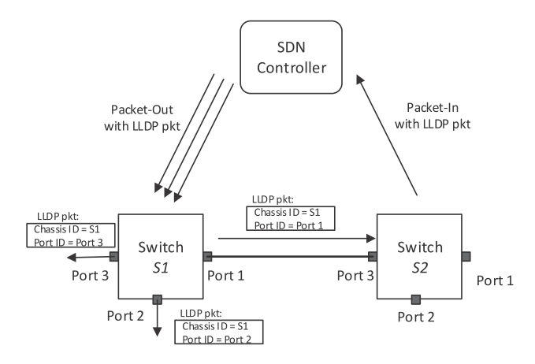
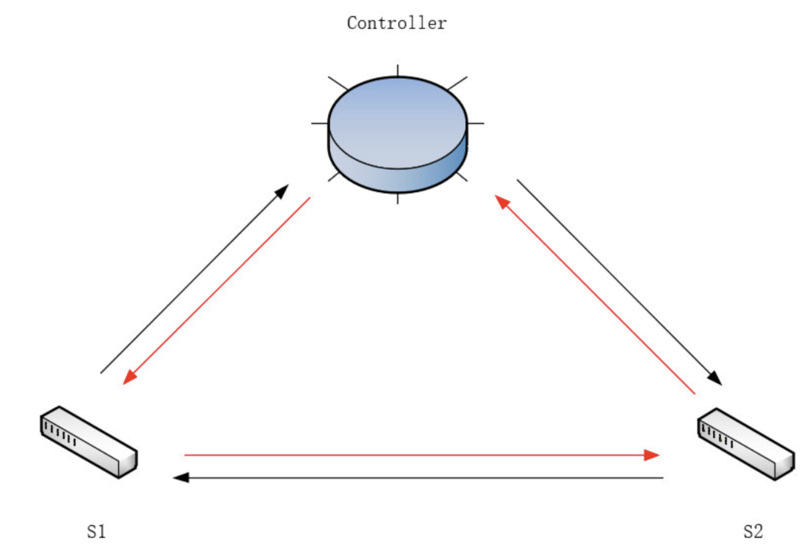
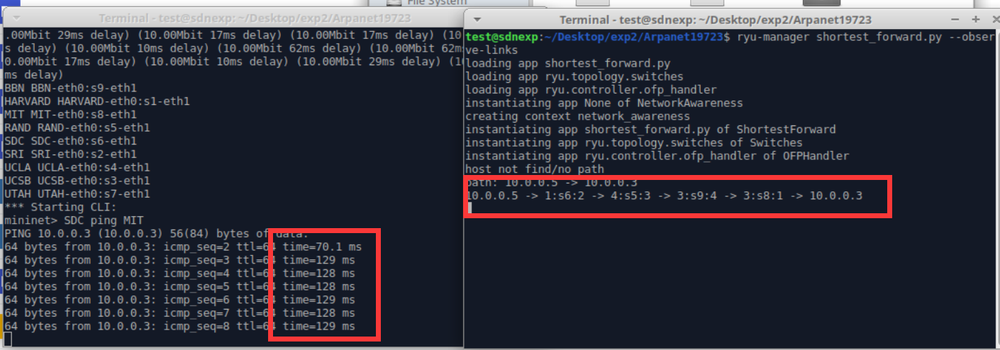
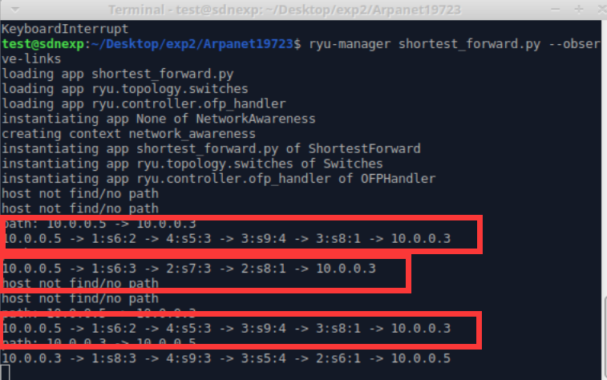
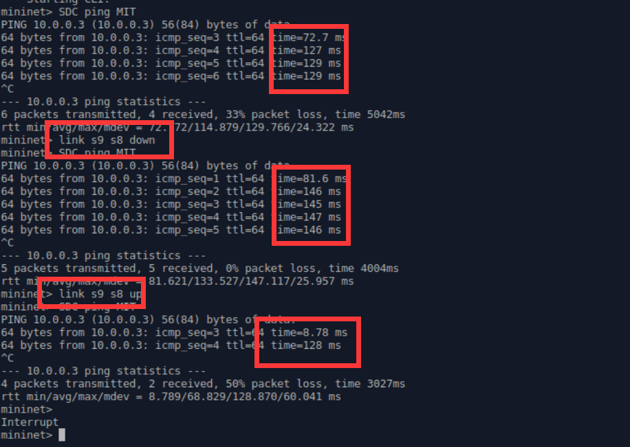

<h1 align="center">实验指导书（三）</h1>


[toc]

## 下载项目

```bash
git clone https://github.com/XJTU-NetVerify/sdn-lab3.git
cd sdn-lab3
```

安装依赖 / 运行步骤和[实验二](https://github.com/XJTU-NetVerify/sdn-lab2)相同。

## 实验目的

通过本次实验，希望大家掌握以下内容：

- 学习利用`os_ken.topology.api`发现网络拓扑。
- 学习利用`LLDP`和`Echo`数据包测量链路时延。
- 学习计算基于跳数和基于时延的最短路由。
- 学习设计能够容忍链路故障的路由策略。
- 分析网络集中式控制与分布式控制的差异，思考SDN的得与失。

## 问题背景



时间来到1970年，在你的建设下`ARPANET`飞速发展，在一年内从原来西部4个结点组成的简单网络逐渐发展为拥有9个结点，横跨东西海岸，初具规模的网络。

`ARPANET`的拓展极大地便利了东西海岸之间的通信，但用户仍然十分关心网络服务的性能。一条时延较小的转发路由将显著提升用户体验，尤其是在一些实时性要求很高的应用场景下。另外，路由策略对网络故障的容忍能力也是影响用户体验的重要因素，好的路由策略能够向用户隐藏一定程度的链路故障，使得个别链路断开后用户间的通信不至于中断。

`SDN`是一种集中式控制的网络架构，控制器可以方便地获取网络拓扑、各链路和交换机的性能指标、网络故障和拓扑变化等全局信息，这也是`SDN`的优势之一。在掌握全局信息的基础上，`SDN`就能实现更高效、更健壮的路由策略。

在正式任务之前，为帮助同学们理解，本指导书直接给出了一个示例。请运行示例程序，理解怎样利用`os_ken.topology.api`获取网络拓扑，并计算跳数最少的路由。

跳数最少的路由不一定是最快的路由，在实验任务一中，你将学习怎样利用`LLDP`和`Echo`数据包测量链路时延，并计算时延最小的路由。

1970年的网络硬件发展尚不成熟，通信链路和交换机端口发生故障的概率较高。在实验任务二中，你将学习在链路不可靠的情况下，设计对链路故障有一定容忍能力的路由策略。

## 示例：最少跳数路径

为了帮助同学们理解，在示例部分中展示如何获取网络拓扑、计算基于跳数的最短路，这些内容有助于完成后续实验任务。

这一部分**不占实验分数，不强行要求，按需自学**即可。

### 拓扑感知

控制器首先要获取网络的拓扑结构，才能够对网络进行各种测量分析，网络拓扑主要包括主机、链路和交换机的相关信息。

#### 1.代码示例

调用`os_ken.topology.api`中的`get_all_host`、`get_all_link`、`get_all_switch`等函数，就可以获得全局拓扑的信息，可以把下述代码保存为`demo.py`然后观察输出。（**注**：运行`os_ken`时应附带`--observe-links`参数。）

```sh
sudo mn --topo=tree,2,2 --controller remote
```

```sh
uv run osken-manager demo.py --observe-links
```

```python
from os_ken.base import app_manager
from os_ken.ofproto import ofproto_v1_3
from os_ken.controller.handler import set_ev_cls
from os_ken.controller.handler import MAIN_DISPATCHER, CONFIG_DISPATCHER
from os_ken.controller import ofp_event
from os_ken.lib.packet import packet
from os_ken.lib.packet import ethernet
from os_ken.lib import hub
from os_ken.topology.api import get_all_host, get_all_link, get_all_switch


class NetworkAwareness(app_manager.OSKenApp):
    OFP_VERSIONS = [ofproto_v1_3.OFP_VERSION]

    def __init__(self, *args, **kwargs):
        super(NetworkAwareness, self).__init__(*args, **kwargs)
        self.dpid_mac_port = {}
        self.topo_thread = hub.spawn(self._get_topology)

    def add_flow(self, datapath, priority, match, actions):
        dp = datapath
        ofp = dp.ofproto
        parser = dp.ofproto_parser

        inst = [parser.OFPInstructionActions(ofp.OFPIT_APPLY_ACTIONS, actions)]
        mod = parser.OFPFlowMod(datapath=dp, priority=priority, match=match, instructions=inst)
        dp.send_msg(mod)

    @set_ev_cls(ofp_event.EventOFPSwitchFeatures, CONFIG_DISPATCHER)
    def switch_features_handler(self, ev):
        msg = ev.msg
        dp = msg.datapath
        ofp = dp.ofproto
        parser = dp.ofproto_parser

        match = parser.OFPMatch()
        actions = [parser.OFPActionOutput(ofp.OFPP_CONTROLLER, ofp.OFPCML_NO_BUFFER)]
        self.add_flow(dp, 0, match, actions)

    def _get_topology(self):
        while True:
            self.logger.info('\n\n\n')

            hosts = get_all_host(self)
            switches = get_all_switch(self)
            links = get_all_link(self)

            self.logger.info('hosts:')
            for hosts in hosts:
                self.logger.info(hosts.to_dict())

            self.logger.info('switches:')
            for switch in switches:
                self.logger.info(switch.to_dict())

            self.logger.info('links:')
            for link in links:
                self.logger.info(link.to_dict())
        
            hub.sleep(2)
```

#### 2.链路发现原理

`LLDP(Link Layer Discover Protocol)`即链路层发现协议，`OSKen`主要利用`LLDP`发现网络拓扑。`LLDP`被封装在以太网帧中，结构如下图。其中深灰色的即为`LLDP`负载，`Chassis ID TLV`,`Port ID TLV`和`Time to live TLV`是三个强制字段，分别代表交换机标识符（在局域网中是独一无二的），端口号和`TTL`。



接下来介绍`OSKen`如何利用`LLDP`发现链路，假设有两个`OpenFlow`交换机连接在控制器上，如下图：



1. `SDN`控制器构造`PacketOut`消息向`S1`的三个端口分别发送`LLDP`数据包，其中将`Chassis ID TLV`和`Port ID TLV`分别置为`S1`的`dpid`和端口号；

2. 控制器向交换机`S1`中下发流表，流表规则为：将从`Controller`端口收到的`LLDP`数据包从他的对应端口发送出去；

3. 控制器向交换机`S2`中下发流表，流表规则为：将从非`Controller`接收到的`LLDP`数据包发送给控制器；

4. 控制器通过解析`LLDP`数据包，得到链路的源交换机，源接口，通过收到的`PacketIn`消息知道目的交换机和目的接口。

#### 3.沉默主机现象

主机如果没有主动发送过数据包，控制器就无法发现主机。运行前面的`demo.py`时，你可能会看到`host`输出为空，这就是沉默主机现象导致的。你可以在`mininet`中运行`pingall`指令，令每个主机发出`ICMP`数据包，这样控制器就能够发现主机。当然命令的结果是`ping`不通，因为程序中并没有下发路由的代码。

### 计算最少跳数路径

#### 核心代码示例

下面第一个函数位于我们给出的`network_awareness.py`文件中，第二个函数位于`least_hops.py`。核心逻辑是，当控制器接收到携带`ipv4`报文的`Packet_In`消息时，调用`networkx`计算最短路（也可以自行实现，比如Dijkstra算法），然后把相应的路由下发到沿途交换机，具体逻辑可以查看附件代码。

<p style='color: red'><b>注意：least_hops.py未处理环路，请根据你在实验一中处理环路的代码对handle_arp函数稍加补充即可。</b></p>

```shell
uv run osken-manager least_hops.py --observe-links
```

``` python
    # function in network_awareness.py
    def shortest_path(self, src, dst, weight='hop'):
        try:
            paths = list(nx.shortest_simple_paths(self.topo_map, src, dst, weight=weight))
            return paths[0]
        except:
            self.logger.info('host not find/no path')
    #
    # function in least_hops.py    
    def handle_ipv4(self, msg, src_ip, dst_ip, pkt_type):
        parser = msg.datapath.ofproto_parser

        dpid_path = self.network_awareness.shortest_path(src_ip, dst_ip,weight=self.weight)
        if not dpid_path:
            return
        self.path=dpid_path
        # get port path:  h1 -> in_port, s1, out_port -> h2
        port_path = []
        for i in range(1, len(dpid_path) - 1):
            in_port = self.network_awareness.link_info[(dpid_path[i], dpid_path[i - 1])]
            out_port = self.network_awareness.link_info[(dpid_path[i], dpid_path[i + 1])]
            port_path.append((in_port, dpid_path[i], out_port))
        self.show_path(src_ip, dst_ip, port_path)
        # send flow mod
        for node in port_path:
            in_port, dpid, out_port = node
            self.send_flow_mod(parser, dpid, pkt_type, src_ip, dst_ip, in_port, out_port)
            self.send_flow_mod(parser, dpid, pkt_type, dst_ip, src_ip, out_port, in_port)
```

因为沉默主机现象，前几次`ping`可能都会输出`host not find/no path`，这属于正常现象。

## 必做题：最小时延路径

跳数最少的路由不一定是最快的路由，链路时延也会对路由的快慢产生重要影响。请实时地（周期地）利用`LLDP`和`Echo`数据包测量各链路的时延，在网络拓扑的基础上构建一个有权图，然后基于此图计算最小时延路径。具体任务是，找出一条从`SDC` 到`MIT`时延最短的路径，输出经过的路线及总的时延，利用`Ping`包的`RTT`验证你的结果。请在`least_hops.py`的代码框架上，在新的文件下**新建**一个控制器（可以命名为`ShortestForward`或类似的名字），并完成任务。

### 测量原理：链路时延

- 测量链路时延的思路可参考下图

  

控制器将带有时间戳的`LLDP`报文下发给`S1`，`S1`转发给`S2`，`S2`上传回控制器（即内圈红色箭头的路径），根据收到的时间和发送时间即可计算出**控制器经`S1`到`S2`再返回控制器的时延**，记为`lldp_delay_s12`

反之，**控制器经`S2`到`S1`再返回控制器的时延**，记为`lldp_delay_s21`

交换机收到控制器发来的Echo报文后会立即回复控制器，我们可以利用`Echo Request/Reply`报文求出**控制器到`S1`、`S2`的往返时延**，记为`echo_delay_s1`, `echo_delay_s2`

则`S1`到`S2`的时延 `delay = (lldp_delay_s12 + lldp_delay_s21 - echo_delay_s1 - echo_delay_s2) / 2`

为此，我们需要对`OSKen`做如下修改：

1. `.venv/lib/python3.13/site-packages/os_ken/topology/switches.py`的`PortData/__init__()`

`PortData`记录交换机的端口信息，我们需要增加`self.delay`属性记录上述的`lldp_delay`

`self.timestamp`为`LLDP`包在发送时被打上的时间戳，具体发送的逻辑查看源码

```python
  class PortData(object):
      def __init__(self, is_down, lldp_data):
          super(PortData, self).__init__()
          self.is_down = is_down
          self.lldp_data = lldp_data
          self.timestamp = None
          self.sent = 0
          self.delay = 0
```

2. `.venv/lib/python3.13/site-packages/os_ken/topology/switches`的`Switches/lldp_packet_in_handler()`

`lldp_packet_in_handler()`处理接收到的`LLDP`包，在这里用收到`LLDP`报文的时间戳减去发送时的时间戳即为`lldp_delay`，由于`LLDP`报文被设计为经一跳后转给控制器，我们可将`lldp_delay`存入发送`LLDP`包对应的交换机端口

```python
    @set_ev_cls(ofp_event.EventOFPPacketIn, MAIN_DISPATCHER)
    def lldp_packet_in_handler(self, ev):
        # add receive timestamp
        recv_timestamp = time.time()
        if not self.link_discovery:
            return

        msg = ev.msg
        try:
            src_dpid, src_port_no = LLDPPacket.lldp_parse(msg.data)
        except LLDPPacket.LLDPUnknownFormat:
            # This handler can receive all the packets which can be
            # not-LLDP packet. Ignore it silently
            return
        
        # calc the delay of lldp packet
        for port, port_data in self.ports.items():
            if src_dpid == port.dpid and src_port_no == port.port_no:
                send_timestamp = port_data.timestamp
                if send_timestamp:
                    port_data.delay = recv_timestamp - send_timestamp
        
        ...
```

3. 获取`lldp_delay`

在你们需要完成的计算时延的`APP`中，利用`lookup_service_brick`获取到正在运行的`switches`的实例（即步骤1、2中被我们修改的类），按如下的方式即可获取相应的`lldp_delay`

```python
    from os_ken.base.app_manager import lookup_service_brick
    
    ...
    
    @set_ev_cls(ofp_event.EventOFPPacketIn, MAIN_DISPATCHER)
    def packet_in_hander(self, ev):
        msg = ev.msg
        dpid = msg.datapath.id
        try:
            src_dpid, src_port_no = LLDPPacket.lldp_parse(msg.data)

            if self.switches is None:
                self.switches = lookup_service_brick('switches')

            for port in self.switches.ports.keys():
                if src_dpid == port.dpid and src_port_no == port.port_no:
                    lldp_delay[(src_dpid, dpid)] = self.switches.ports[port].delay
        except:
            return
```

### 运行拓扑

```shell
sudo ./topo_1970.py
```

### 问题提示

- 注意时延不应为负，测量出负数应取0。

### 结果示例

- 输出格式参考下图。
- 每条链路的时延已经在拓扑文件中预设了，请将自己的测量结果与预设值对比验证。



## 选做题：容忍链路故障

1970年的网络硬件发展尚不成熟，通信链路和交换机端口发生故障的概率较高。请设计`OSKen app`，在任务一的基础上实现容忍链路故障的路由选择：每当链路出现故障时，重新选择当前可用路径中时延最低的路径；当链路故障恢复后，也重新选择新的时延最低的路径。

请在实验报告里附上你计算的（1）最小时延路径（2）最小时延路径的`RTT`（3）链路故障/恢复后发生的路由转移。

### 任务说明

- 模拟链路故障

`mininet`中可以用`link down`和`link up`来模拟**链路故障**和**故障恢复**:

```shell
mininet>link s1 s4 down
mininet>link s1 s4 up
```

- 控制器捕捉链路故障

链路状态改变时，链路关联的端口状态也会变化，从而产生端口状态改变的事件，即`EventOFPPortStatus`，通过将此事件与你设计的处理函数绑定在一起，就可以获取状态改变的信息，执行相应的处理。

`os_ken`自带的`EventOFPPortStatus`事件处理函数位于`.venv/lib/python3.13/site-packages/os_ken/controller/ofp_handler.py`中，部分代码截取在下方。你可以以此为例，在你的代码中实现你需要的`EventOFPPortStatus`事件处理函数。

```python
@set_ev_handler(ofp_event.EventOFPPortStatus, MAIN_DISPATCHER)
def port_status_handler(self, ev):
    msg = ev.msg
    datapath = msg.datapath
    ofproto = datapath.ofproto

    if msg.reason in [ofproto.OFPPR_ADD, ofproto.OFPPR_MODIFY]:
        datapath.ports[msg.desc.port_no] = msg.desc
    elif msg.reason == ofproto.OFPPR_DELETE:
        datapath.ports.pop(msg.desc.port_no, None)
    else:
        return

    self.send_event_to_observers(
        ofp_event.EventOFPPortStateChange(
            datapath, msg.reason, msg.desc.port_no),
        datapath.state)
```

- `OFPFC_DELETE` 消息

与向交换机中增加流表的`OFPFC_ADD`命令不同，`OFPFC_DELETE` 消息用于删除交换机中符合匹配项的所有流表。

由于添加和删除都属于`OFPFlowMod`消息，因此只需稍微修改`add_flow()`函数，即可生成`delete_flow()`函数。

- `Packet_In`消息的合理利用

基本思路是在链路发生改变时，删除受影响的链路上所有交换机上的相关流表的信息，下一次交换机将匹配默认流表项，向控制器发送`packet_in`消息，控制器重新计算并下发最小时延路径。

### 结果示例

`SDC ping MIT`，一开始选择时延最小路径，`RTT`约`128ms`。

`s9`和`s8`之间的链路故障后，重新选择现存的时延最小路径，`RTT`约`146ms`。

`s9`和`s8`之间的链路从故障中恢复后，重新选择时延最小路径。




